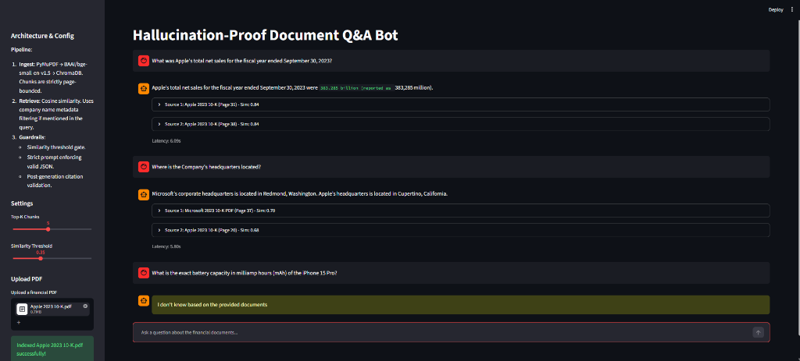
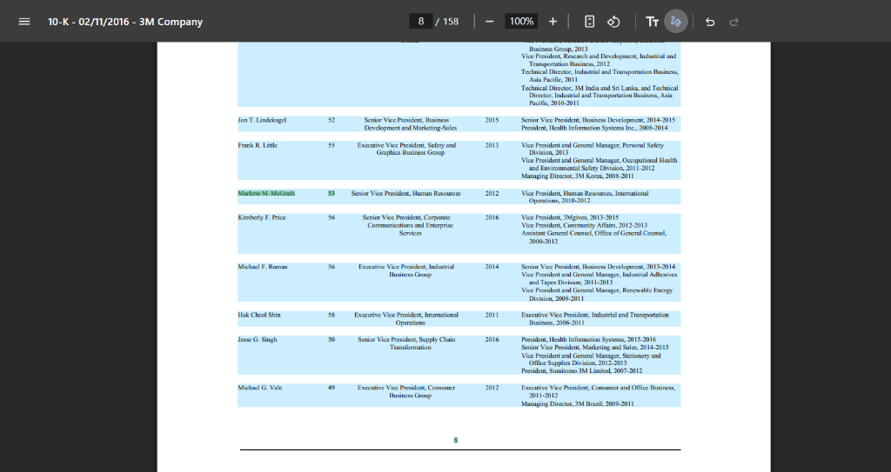
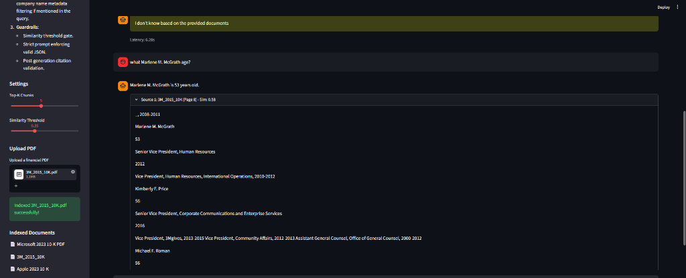

# Hallucination-Proof Document Q&A Bot



A deterministic, retrieval-augmented generation (RAG) assistant for complex financial filings (10-Ks, annual reports). Engineered specifically to eliminate hallucinations and produce verifiable, page-level source citations.

---

## Dataset

- **Benchmark Dataset:** [PatronusAI/financebench](https://huggingface.co/datasets/PatronusAI/financebench)
- Target corpora consist of SEC 10-K filings, earnings releases, and annual reports.

---

## Key Features

- **Page-Bounded Chunking:** Chunks strictly never cross page boundaries, eliminating ambiguous multi-page citations.
- **Entity-Prefixed Chunks:** Prepends `[Document | Page N]` metadata to text chunks prior to vectorization to boost retrieval relevance for company names and fiscal years.
- **Three-Layer Guardrail Architecture:**
  1. *Retrieval Gate:* Pre-LLM filter rejecting questions falling below cosine similarity thresholds.
  2. *Strict Prompt Schema:* Constrained zero-temperature generation enforcing valid JSON (`{"answerable": bool, "answer": str, "citations": [...]}`).
  3. *Deterministic Post-Validator:* Programmatic verification that cited chunk IDs exist within the retrieved context window before displaying the response.
- **Zero-Tolerance Refusal:** Defaults to the exact string `"I don't know based on the provided documents"` whenever context is insufficient or unverified.
- **Local & Offline-First:** PDF parsing, chunking, embedding generation (`BAAI/bge-small-en-v1.5`), and vector storage (`ChromaDB`) execute 100% locally.

---

## Proof of Precision

To demonstrate the exact page-level citations and complex tabular extraction, here is an example pulling a specific executive's age directly from a 3M 10-K document (Page 8):

**Original PDF Document:**


**Bot Extraction & Exact Citation:**


---

## Tech Stack

- **Frontend:** Streamlit
- **Vector Store:** ChromaDB (Local, persistent storage)
- **Embeddings:** `BAAI/bge-small-en-v1.5` via `sentence-transformers` (Normalized cosine similarity)
- **PDF Extraction:** PyMuPDF (`fitz`)
- **Generation:** Groq SDK (`openai/gpt-oss-120b`)
- **Environment & Config:** `python-dotenv`, Python 3.11

---

## Setup & Running

### 1. Installation
```bash
python -m venv venv
# Windows:
.\venv\Scripts\Activate.ps1
# Linux/macOS:
source venv/bin/activate

pip install -r requirements.txt
```

### 2. Environment Configuration

Create a `.env` file in the root directory:

```bash
GROQ_API_KEY=gsk_your_groq_api_key_here
```

### 3. Ingestion

Place target financial PDFs inside `data/pdfs/` and run:

```bash
python -m rag.ingest
```

### 4. Launch Application

```bash
streamlit run app.py
```

---

## Evaluation Benchmark

Run the automated evaluation suite:

```bash
python -m eval.run_eval
```

### Benchmark Results Summary

* **Citation Hit Rate:** 100% (Retrieved chunk page corresponds to verified evidence page).
* **Refusal Precision:** 100% (Zero false positives on out-of-domain trivia and unindexed entities).
* **Recommended Threshold:** `SIM_THRESHOLD = 0.35` provides the optimal balance between high recall on nuanced financial metrics and complete rejection of out-of-scope queries.

---

## Design Choices & Trade-offs

* **Why `BAAI/bge-small-en-v1.5`?** High MTEB ranking for retrieval density while keeping inference sub-50ms locally without requiring dedicated GPU acceleration.
* **Chunk Size (1000 characters, 200 overlap):** Financial statements contain dense tabular commentary; 1000 characters typically encapsulates a single financial narrative or disclosure block while 200 characters prevents boundary information loss.
* **Why Three Guardrail Layers?** Prompt engineering alone fails under adversarial phrasing. The retrieval similarity gate saves API latency and token cost on clear misses, while post-generation ID matching catches hallucinated citation numbers.

---

## Known Limitations

1. **Complex Multi-Page Tables:** Borderless financial tables split across consecutive pages may lose column header alignment due to strict single-page boundary chunking.
2. **Scanned / Image PDFs:** Relies on PyMuPDF text extraction; non-OCR scanned documents require an upstream OCR preprocessing pipeline (e.g., Tesseract or Surya).
3. **Multi-Hop Calculations:** Questions requiring arithmetic synthesis across non-contiguous sections rely on LLM context stitching without an external Python REPL calculator tool.
